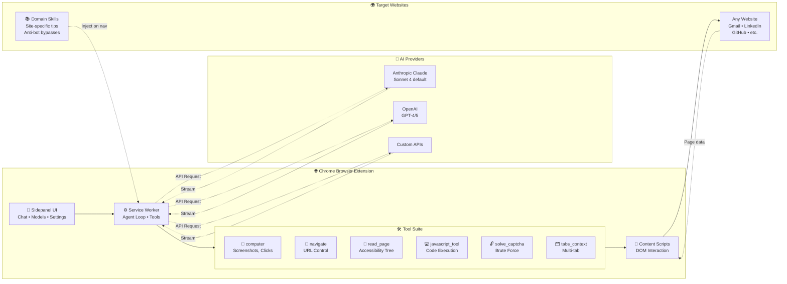

# LLM in Chrome - Architecture

## System Architecture



## Component Details

### 1. Browser Extension Layer

**Sidepanel UI**
- Modern chat interface with markdown rendering
- Multi-image upload support
- Model selection (Anthropic, OpenAI, GitHub, Custom)
- Domain skills management (built-in + user overrides)
- Real-time streaming responses

**Service Worker (Background)**
- Agentic loop: plan → execute → observe → repeat
- Tool orchestration and execution
- Conversation history management
- Domain skills injection
- CAPTCHA solver integration

**Content Scripts**
- Accessibility tree inspection
- DOM manipulation
- Screenshot capture
- Event simulation (mouse, keyboard)

### 2. Tools Layer

| Tool | Purpose | Implementation |
|------|---------|----------------|
| `computer` | Screenshots, clicks, typing | Chrome DevTools Protocol |
| `navigate` | URL navigation, back/forward | chrome.tabs API |
| `read_page` | Extract page structure | Accessibility tree + vision |
| `javascript_tool` | Execute code in page context | chrome.scripting API |
| `solve_captcha` | Automated CAPTCHA solving | Brute force + token injection |
| `tabs_context` | Multi-tab management | chrome.tabs API |

### 3. AI Providers

**Supported Models**
- **Anthropic Claude**: Opus 4.5, Sonnet 4, Haiku 4.5
- **OpenAI**: GPT-4, GPT-5 (via Codex)
- **GitHub Copilot**: Chat & completions
- **Custom**: Any OpenAI-compatible API

### 4. Domain Skills System

**Built-in Skills**
- Gmail, Google Docs/Sheets/Drive
- GitHub, LinkedIn, Indeed
- Slack, Twitter, Amazon
- Custom hackathon sites (with anti-bot bypasses)

**User Skills**
- Override built-in skills per domain
- Add new domains
- Stored in `chrome.storage.local`

## Data Flow

### User Request Flow
```
User types message + attaches images
    ↓
Sidepanel sends to Service Worker
    ↓
Service Worker builds messages array with:
    - System prompt (tool definitions + domain skills)
    - Conversation history
    - Current screenshot
    - User images (base64)
    ↓
POST to selected AI provider API
    (e.g., Anthropic Claude, OpenAI, Custom endpoint)
    ↓
Streaming response chunks back to Service Worker
    ↓
Service Worker updates UI in real-time
```

### Tool Execution Flow
```
AI decides to use a tool (e.g., "click button")
    ↓
Service Worker receives tool_use block
    ↓
Execute tool via Chrome APIs:
    - computer: CDP for screenshots/clicks
    - navigate: chrome.tabs.update()
    - read_page: query accessibility tree
    - javascript_tool: chrome.scripting.executeScript()
    ↓
Collect result (success/error/data)
    ↓
Add tool_result to messages array
    ↓
Send back to AI for next decision
```

### CAPTCHA Solving Flow (Deckathon Example)
```
AI encounters CAPTCHA on /dropout page
    ↓
Calls solve_captcha(tabId)
    ↓
Brute force solver:
    - Try all image combinations
    - POST to /captcha/submit
    - Get captcha_solved_token
    ↓
Inject token + call /dropout API:
    - Import page's axios instance
    - POST with token + entropy values
    - Page reloads to show success
```

## Key Features

### 1. Computer Use
- Full browser automation via CDP
- Screenshot analysis (vision)
- Click, type, scroll, navigate
- Multi-tab support

### 2. Domain-Specific Knowledge
- Automatic skill injection based on URL
- Site-specific best practices
- Anti-bot bypass techniques
- User-customizable per domain

### 3. Agentic Behavior
- Multi-step task planning
- Self-correction on errors
- Tool chaining (read → analyze → click)
- Ask-before-acting mode (optional)

### 4. Multi-Modal
- Screenshots automatically included
- User can attach multiple images
- Vision model analyzes UI elements
- Combine text + visual context

### 5. Extensible
- Plugin system (CCProxy)
- Custom model support
- User-defined domain skills
- Open architecture

## Configuration

### Extension Settings
- Stored in `chrome.storage.local`
- Provider API keys
- Custom models (name, URL, API key)
- Domain skills (user overrides)
- Current model selection
- API base URL and model ID

## Technology Stack

**Extension**
- Vanilla JavaScript (no framework)
- Chrome Extension Manifest V3
- Chrome DevTools Protocol (CDP)
- Accessibility Tree API
- Streaming SSE response handling

**AI Providers**
- Anthropic Claude API (Messages API)
- OpenAI API (Chat Completions)
- Any OpenAI-compatible API

---

## Use Cases

1. **Web Automation**: Fill forms, navigate sites, extract data
2. **Research**: Multi-tab browsing, information gathering
3. **Testing**: QA workflows, regression testing
4. **Development**: Inspect pages, debug JavaScript
5. **Personal Assistant**: Email management, job applications
6. **Challenge Solving**: Hackathons, CTFs, anti-bot bypasses
